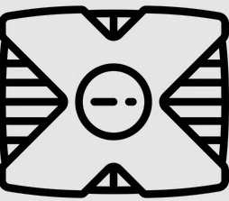

<div align="center">
  
  <br/>
</div>
<div align="center">
  <h1><b>Videogames Back End</b></h1>
</div>

<!--

REQUIRED SECTIONS:
- Table of Contents
- About the Project
  - Built With
  - Live Demo
- Getting Started
- Authors
- Future Features
- Contributing
- Show your support
- Acknowledgements
- License

OPTIONAL SECTIONS:
- FAQ
-->

# 📗 Table of Contents

- [📖 About the Project](#about-project)
  - [🛠 Built With](#built-with)
    - [Tech Stack](#tech-stack)
    - [Key Features](#key-features)
  - [🚀 Live Demo](#live-demo)
- [💻 Getting Started](#getting-started)
  - [Prerequisites](#prerequisites)
  - [Setup](#setup)
  - [Install](#install)
  - [Usage](#usage)
- [👥 Authors](#authors)
- [🔭 Future Features](#future-features)
- [🤝 Contributing](#contributing)
- [⭐️ Show your support](#support)
- [🙏 Acknowledgements](#acknowledgements)
- [📝 License](#license)

<!-- PROJECT DESCRIPTION -->

# 🎮 mc_videgames_back <a name="about-project"></a>

**mc_videgames_back** is the backend implementation of the final capstone group from Microverse. It is an application that interacts with the frontend applications that allows users to create an account, choose their favorite video games and create a reservation.

## 🛠 Built With <a name="built-with"></a>
- `Ruby on Rails`
- `Postgresql`
- `Rswag`

### Tech Stack <a name="tech-stack"></a>

<details>
  <summary>Client</summary>
  <ul>
    <li><a href="https://rubyonrails.org/">Ruby on Rails</a></li>
  </ul>
</details>

<details>
<summary>Database</summary>
  <ul>
    <li><a href="https://www.postgresql.org/">PostgreSQL</a></li>
  </ul>
</details>

<!-- Features -->

### Key Features <a name="key-features"></a>

- **[API endpoint for users, videogames and reservations]**
- **[API documentation with rswag]**

<p align="right">(<a href="#readme-top">back to top</a>)</p>

<!-- LIVE DEMO -->

## 🚀 Live Demo <a name="live-demo"></a>

- [Live Demo Link](https://mc-videogames-back.onrender.com)

<p align="right">(<a href="#readme-top">back to top</a>)</p>

<!-- KANBAN BOARD -->

## ⚙️ Kanban Board <a name="kanban-board"></a>

- [Kanban board Link](https://github.com/users/sanieni6/projects/5)

<!-- LINK TO FRONT-END -->

## 🔗 Link to front end <a name="link-front"></a>

- [Frontend link](https://github.com/DavidEspinoG/mc_videogames_front)

<!-- GETTING STARTED -->

## 💻 Getting Started <a name="getting-started"></a>

To get a local copy up and running, follow these steps.

### Prerequisites

In order to run this project you need:
- Ruby version 3.1.3 or later
- Rails version 7 or later
- Postgresql

### Setup

Clone this repository to your desired folder:

```sh
  git https://github.com/sanieni6/mc_videogames_back.git
  cd mc_videgames_back
```

### Install

Install this project with:

 - `bundle install`
 - `rails db:setup`

### Usage

To start the server, execute the following command:

`rails server`


<p align="right">(<a href="#readme-top">back to top</a>)</p>

<!-- AUTHORS -->

## 👥 Authors <a name="authors"></a>

👤 **Alejandra Keber Maggi**
- GitHub: [@AlejandraKeber](https://github.com/AlejandraKeber)
- Twitter: [@KeberAlejandra](https://twitter.com/KeberAlejandra)
- LinkedIn: [alejandra-keber](https://www.linkedin.com/in/alejandra-keber)

👤 **David Espino**

- GitHub: [@DavidEspinoG](https://github.com/DavidEspinoG)
- Twitter: [@DavidEspinoG](https://twitter.com/DavidEspinoG)
- LinkedIn: [davidespinog](https://linkedin.com/in/davidespinog)

👤 **Dico Diaz Dussan**

- GitHub: [@dicodiaz](https://github.com/dicodiaz)
- LinkedIn: [Dico Diaz Dussan](https://www.linkedin.com/in/dico-diaz-dussan/)
- Portfolio: [portfolio.dicodiaz.com.co](https://portfolio.dicodiaz.com.co)

👤 **Luis Sanchez**

- Github: [GitHub](https://github.com/sanieni6/)
- Twitter: [Twitter](https://twitter.com/its_luis_sz23)
- Linkedin:  [LinkedIn](https://www.linkedin.com/in/luissanchezz3/)

👤 **Nicolas Olaya**

- GitHub: [@NicolasAndrehh](https://github.com/NicolasAndrehh)
- Twitter: [@nicolasolaya22](https://twitter.com/nicolasolaya22)
- LinkedIn: [LinkedIn](https://www.linkedin.com/in/nicolas-olaya/)


<p align="right">(<a href="#readme-top">back to top</a>)</p>

<!-- FUTURE FEATURES -->

## 🔭 Future Features <a name="future-features"></a>

- [ ] **[Add unit tests]**

<p align="right">(<a href="#readme-top">back to top</a>)</p>

<!-- CONTRIBUTING -->

## 🤝 Contributing <a name="contributing"></a>

Contributions, issues, and feature requests are welcome!

Feel free to check the [issues page](https://github.com/sanieni6/mc_videogames_back/issues).

<p align="right">(<a href="#readme-top">back to top</a>)</p>

<!-- SUPPORT -->

## ⭐️ Show your support <a name="support"></a>

If you like this project please give it a star ⭐️

<p align="right">(<a href="#readme-top">back to top</a>)</p>

<!-- ACKNOWLEDGEMENTS -->

## 🙏 Acknowledgments <a name="acknowledgements"></a>

I would like to thank 
- [Microverse](https://www.microverse.org/) for the opportunity.
- Code Reviewers
- Coding Partners
- Special thank to [Murat Korkmaz](https://www.behance.net/gallery/26425031/Vespa-Responsive-Redesign) for providing the design guidelines.

<p align="right">(<a href="#readme-top">back to top</a>)</p>

<!-- LICENSE -->

## 📝 License <a name="license"></a>

This project is [MIT](./LICENSE) licensed.

<p align="right">(<a href="#readme-top">back to top</a>)</p>


